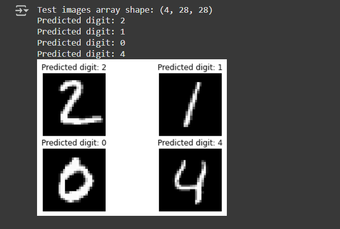
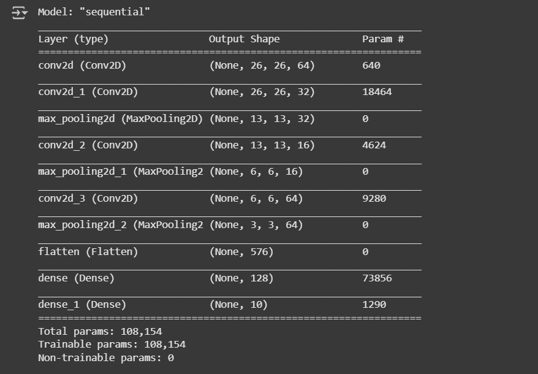
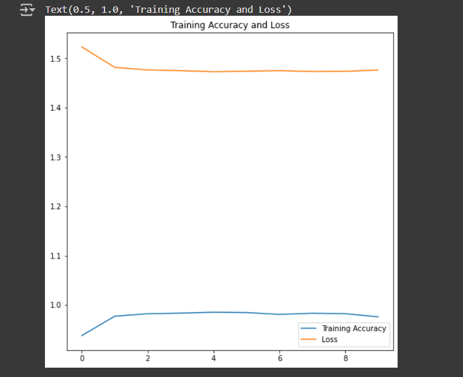

🖊 Handwritten Digit Recognition using Deep Learning
This project implements Handwritten Digit Recognition using Deep Learning. A Convolutional Neural Network (CNN) is trained on the MNIST dataset to classify handwritten digits (0-9) with high accuracy.
A neural network is made up by stacking layers of neurons, and is defined by the weights 
of connections and biases of neurons. Activations are a result dependent on a certain input.

This structure is known as a feedforward architecture because the connections in the network flow forward from the input layer to the output layer without any feedback loops.

MODEL SUMMARY-

 

🔹 Features and model summary

✅ Deep Learning Model: Uses a CNN to accurately classify handwritten digits

✅ Dataset: Trained on the MNIST dataset (60,000 training + 10,000 test images)

✅ High Accuracy: Achieves over 98% accuracy on test data

✅ Image Processing: Preprocesses input images for better recognition

✅ Visualization: Displays training accuracy, loss curves, and sample predictions

✅CNN Architecture: Multiple convolutional layers with max pooling

✅Flatten & Dense Layers: Fully connected layers for classification

✅ Output: Probability scores for digits 0-9

🔹 Tech Stack
Python 🐍

TensorFlow / Keras 🤖

OpenCV 📷 (for image preprocessing)

Matplotlib 📊 (for visualization)

🔹 Results

Achieves 98%+ accuracy on the MNIST dataset 🔺

Can recognize hand-drawn digits from images or real-time input
